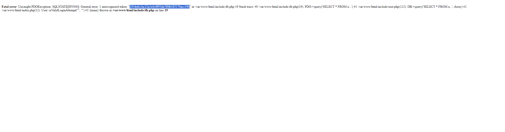
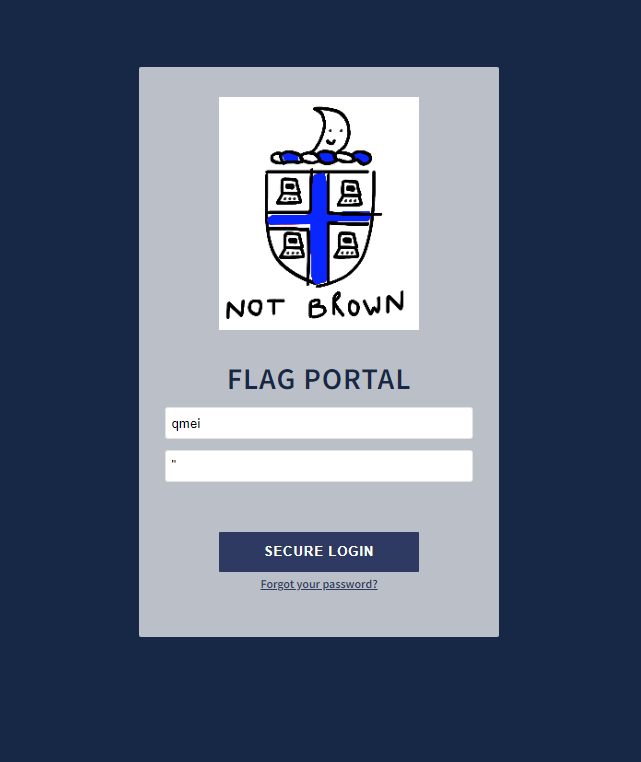
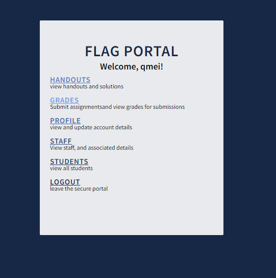
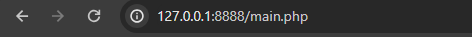

# _Project: FLAG_

## **Vulnerabilities:**

### URL Path Parameters

> https://www.127.0.0.1:8888/list-profiles.php?who=student&id=any_id
> 
    This means that an attacker can view all students from this page. Then from the URL he/she can see the student id
    that is being used in the code to store it. This is a very potential risk as it causes serious security issues.
    If an attacker can see a student id in the URL Query Parameters, then he/she can use this id to initiate an attack
    or perform further reconnaissance on it.

    Moreover, an attacker can list profiles of all students present on the server and can create a Database from it.
    
    For example,
    
    > https://www.127.0.0.1:8888/list-profiles.php?who=student&id=38

    This is a student in the server whose name is "aabreu". See, attacker was able to fetch information from the server
    just by using these id in utl query params.

***
## Hidden Files:
    
    > In addition to all of these, attacker was able to get infomration about some hidden files. These files include,

        1. user.php
        2. db.php
    
    Furthermore, in the code attacker was able to fetch that user is using PDO to connect to database and is using 
    some (isValidLoginAttempt('user','password')) function to validate user names and their passwords.
    
    Page gives access to main.php if this function returns true otherwise it restricts users to index.php

    Proof:
    

    > This image shows the proof of using isValidateLoginAttempt() function in the code in the db.php file.

***
## Changing Password to Special Characters:

    > Adding, attacker was able to change the password of default or any student to the special characters such as,
    (",',>,?,;) etc. He/She as able to bypass the restriction layer provided by the funciton in the HTMML Document
    ValidateUserData(). 

    > As an example and proof attacker changed the password of default login "username = qmei" and password = """
    Before Login,

    After Login,

    And to verfy URL,

***

## Total Vulnerabilities Exploited:
### Three
***

# THE END.
***